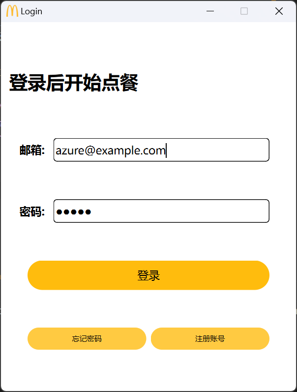

# McDonald-s-OrderSystem
基于PYQT+MySQL开发的一个麦当劳点餐客户端系统

## 环境需求
- python 3.8及以上
- MySQL 5.7及以上

## 项目配置运行

- 运行 `order_system.sql` 中的所有命令
- 使用 `pip install -r requirements.txt` 安装第三方库
- 进入到 `ui` 目录下, 运行 `python login_windows.py` 指令

## 运行效果
1. 登录界面
2. 首页
3. 优惠套餐页面
4. 精选套餐页面
5. 点餐页面
6. 选购页面
7. 购物车页面
8. 订单支付结算页面
9. 订单管理页面
